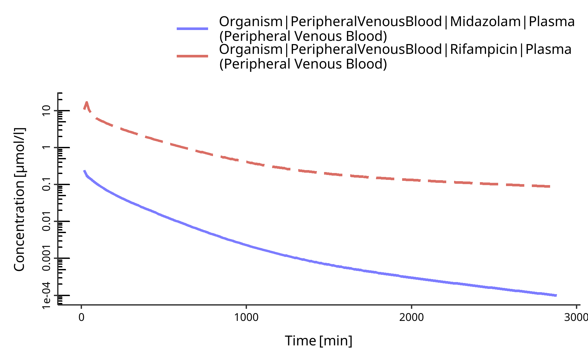

<!-- README.md is generated from README.Rmd. Please edit that file -->

# cts

<!-- badges: start -->
<!-- badges: end -->

The `{cts}` (Contraceptives DDI Trial Simulation Platform) package
provides a comprehensive R-based framework for designing and simulating
drug-drug interactions (DDI) involving contraceptive drugs using
physiologically based pharmacokinetic (PBPK) models. This package allows
researchers to conduct *in silico* DDI simulations programmatically,
enabling more automated and reproducible workflows. This is particularly
useful for performing batch simulations, and integrating DDI modeling
into larger R-based data analysis pipelines, thus enhancing flexibility
and efficiency in model development and simulation.

#### Key Features

- Import and Explore Compound Models: Retrieve compound models snapshots
  from the OSP model library, a URL, or a local file in JSON format.
- Simulate DDIs: Design and run DDI simulations between compounds,
  specifying dosing protocols, individual characteristics, and other
  simulation parameters.
- Analyze Results: In addition to simulation results, this packages
  provides an immediate and first glance at the data by providing basic
  plots and tables.
- Seamless Integration: Supports the export of simulation snapshots
  compatible with PK-Sim, enabling further configuration, exploration
  and analysis.

## Installation

You can install the development version of `cts` from
[GitHub](https://github.com/) with:

``` r
# install.packages("pak")
pak::pak("esqLABS/cts")
```

## Example

Below are some examples to demonstrate how to use the package. These
steps will guide you through importing compound models, exploring their
properties, and simulating drug-drug interactions.

### List Available Compound Building Blocks

The `{cts}`package can interface with the Open Systems Pharmacology
(OSP) model library to retrieve compound models. The `list_compounds()`
function lists all available compounds in the OSP model library.

``` r
library(cts)

list_compounds()
```

    #> ℹ Listing Compounds Building Blocks available in OSP repositories
    #> ✖ Listing Compounds Building Blocks available in OSP repositories ... failed
    #> 
    #> • Alfentanil
    #> • Alprazolam
    #> • Amikacin
    #> • Atazanavir
    #> • Carbamazepine
    #> • Cimetidine
    #> • Clarithromycin
    #> • Dapagliflozin
    #> • Efavirenz
    #> • Erythromycin
    #> • Ethinylestradiol
    #> • Felodipine
    #> • Fluconazole
    #> • Fluvoxamine
    #> • Itraconazole
    #> • Hydroxy-Itraconazole
    #> • Keto-Itraconazole
    #> • N-desalkyl-Itraconazole
    #> • Mefenamic acid
    #> • Mexiletine
    #> • Midazolam
    #> • Moclobemide
    #> • Montelukast
    #> • Omeprazole
    #> • Esomeprazole
    #> • R-omeprazole
    #> • Raltegravir
    #> • Rifampicin
    #> • S-Mephenytoin
    #> • Sildenafil
    #> • Sufentanil
    #> • Tizanidine
    #> • Triazolam
    #> • Vancomycin
    #> • Verapamil

This command outputs a list of compound names available in the OSP model
library, which you can select to create your DDI simulations.

### Import Snapshots

The core functionality of the package involves importing compound models
from snapshot files. You can import a compound model in various ways:

#### From OSP Qualified Building Blocks

You can directly import pre-qualified compounds from the OSP model
library:

``` r
rifampicin <- compound("Rifampicin")
midazolam <- compound("Midazolam")
```

#### From URL

For compound models hosted online, use the URL to import the model:

``` r
compound("https://raw.githubusercontent.com/Open-Systems-Pharmacology/Alfentanil-Model/v2.2/Alfentanil-Model.json")
```

#### From Local File

You can also import compound models from local JSON files:

``` r
compound("path/to/Alfentanil-Model.json")
```

### Explore Snapshots

Once you have imported a compound snapshot, you can explore its
properties, such as compound properties, formulations, protocols,
predefined simulations and all other information contained in the
snapshot. For example, you can explore the formulations of Rifampicin
using the following command:

``` r
rifampicin$protocols[[1]]
```

This command outputs the formulations that are defined for the compound
and that can be used in simulations.

## Add new building blocks

Only administration protocols can be altered/added/removed from
snapshots

``` r
my_protocol <- create_protocol("my_protocol",
                type = "oral",
                interval = "single",
                dose = 200,
                water_vol_per_body_weight = 3.5)

my_protocol
```

``` r
add_protocol(rifampicin, my_protocol)
```

``` r
purrr::map_chr(rifampicin$protocols, "name")
#>  [1] "iv 300 mg (0.5 h)"                                  
#>  [2] "iv 300 mg (3 h)"                                    
#>  [3] "iv 450 mg (3 h)"                                    
#>  [4] "iv 600 mg (0.5 h)"                                  
#>  [5] "iv 600 mg (3 h)"                                    
#>  [6] "iv 600 mg (3 h) MD OD (7 days)"                     
#>  [7] "po 300 mg"                                          
#>  [8] "po 450 mg"                                          
#>  [9] "po 600 mg"                                          
#> [10] "po 600 mg MD OD (7 days)"                           
#> [11] "po 450 mg MD OD (7 days)"                           
#> [12] "po 600 mg MD OD (16 days)"                          
#> [13] "Chattopadhyay 2018 - Rifampicin - 600 mg MD 11 days"
#> [14] "my_protocol"
```

## Create, Parameterize and Run a DDI Project

After importing the necessary compounds, you can create a DDI
simulation. Here is a basic example of creating a DDI simulation with a
victim compound (e.g., Rifampicin) and a perpetrator compound (e.g.,
Midazolam):

Some additional options can be passed during ddi creation:

``` r
myDDI <- create_ddi(
  victim = rifampicin, perpetrator = midazolam,
  options = list(
    import_simulations = FALSE,
    create_ddi_simulation = TRUE
  )
)
```

All options can be found in the `?create_ddi` help page.

By default, the `create_ddi` function will generate a generic and
ready-to-run ddi simulation.

## Run the DDI simulations

Simulations defined in snapshots can easily be executed and their
results retrieved using the `run_ddi()` function:

``` r
results <- run_ddi(myDDI)
```

This will return a named list of data frames containing the simulation
results for each simulation in the DDI project. You can access the
results for a specific simulation using its name as a list index:

``` r
head(results$`Generic DDI simulation`)
```

| IndividualId | Time | paths | simulationValues | TimeDimension | TimeUnit | dimension | unit | molWeight |
|---:|---:|:---|---:|:---|:---|:---|:---|---:|
| 0 | 0 | Organism\|PeripheralVenousBlood\|Rifampicin\|Plasma (Peripheral Venous Blood) | 0 | Time | min | Concentration (molar) | µmol/l | 822.94 |
| 0 | 0 | Organism\|PeripheralVenousBlood\|Midazolam\|Plasma (Peripheral Venous Blood) | 0 | Time | min | Concentration (molar) | µmol/l | 325.78 |
| 0 | 0 | Organism\|VenousBlood\|Plasma\|Rifampicin\|Concentration in container | 0 | Time | min | Concentration (molar) | µmol/l | 822.94 |
| 0 | 0 | Organism\|VenousBlood\|Plasma\|Midazolam\|Concentration in container | 0 | Time | min | Concentration (molar) | µmol/l | 325.78 |
| 0 | 0 | Organism\|Lumen\|Rifampicin\|Fraction of oral drug mass absorbed into mucosa | 0 | Time | min | Fraction |  | 822.94 |
| 0 | 0 | Organism\|Lumen\|Midazolam\|Fraction of oral drug mass absorbed into mucosa | 0 | Time | min | Fraction |  | 325.78 |

Results can also be exported as csv and pkml files with the `path` and
`exportPKML` arguments:

``` r
results <- run_ddi(myDDI, path = "output_directory/", exportPKML = TRUE)
```

## Get PK Parameters

PK parameters can be computed directly from the simulation results using
`run_pk_analysis()` function:

``` r
pk_analysis <- run_pk_analysis(myDDI)
```

As well as results, the PK statistics can be accessed by simulation
name:

``` r
head(pk_analysis$`Generic DDI simulation`)
```

| QuantityPath | Parameter | Unit | Rifampicin | Midazolam |
|:---|:---|:---|---:|---:|
| Organism\|PeripheralVenousBloodPlasma (Peripheral Venous Blood) | C_max | µmol/l | 1.716535e+01 | 2.473786e-01 |
| Organism\|PeripheralVenousBloodPlasma (Peripheral Venous Blood) | C_max_norm | mg/l | 3.437340e+06 | 1.074547e+06 |
| Organism\|PeripheralVenousBloodPlasma (Peripheral Venous Blood) | t_max | h | 5.000000e-01 | 2.500000e-01 |
| Organism\|PeripheralVenousBloodPlasma (Peripheral Venous Blood) | C_tEnd | µmol/l | 8.767600e-02 | 4.490000e-05 |
| Organism\|PeripheralVenousBloodPlasma (Peripheral Venous Blood) | AUC_tEnd | µmol\*min/l | 2.808189e+03 | 2.978657e+01 |
| Organism\|PeripheralVenousBloodPlasma (Peripheral Venous Blood) | AUC_tEnd_norm | µg\*min/l | 5.623362e+11 | 1.293849e+11 |

## Plot ddi simulations

DDI simulations can be generated using the `plot_ddi_results()`
function:

``` r
plots <- plot_ddi_results(myDDI)
```

Similarly plots can be accessed and visualized by simulation name:

``` r
plots$`Generic DDI simulation`
#> $`Concentration (molar)`
```



## Export the DDI project as a Snapshot

You can also export the entire DDI simulation as a snapshot file for
future use or for importing into other platforms such as PK-Sim:

``` r
# Export the DDI simulation to a JSON snapshot file
export_ddi(myDDI, "path/to/Rifampicin-Midazolam-DDI.json")
```

## What’s Next

It is also possible to define new simulations, then add or remove them
from the DDI object.

``` r
# Work in progress
add_simulation(myDDI,
  name = "New Simulation",
  model = "4Comp",
  perpetrator = "midazolam",
  individual = "Male",
  victim_formulation,
  victim_protocol,
  perpetrator_formulation,
  perpetrator_protocol,
  ...
)

remove_simulation(myDDI, "New Simulation")
```

## Dependencies

The `{cts}` package relies on several components from the Open Systems
Pharmacology Suite:

- **R version 4.4.0 or higher**.
- **External R packages**: `{ospsuite}` for interaction with the PK-Sim
  core and `{rSharp}` for R and C# integration. These packages are
  installed automatically when you install `{cts}`.

For more details on the installation and dependency requirements for
`{ospsuite}`, please visit the `{ospsuiteR}` GitHub page
[here](https://github.com/Open-Systems-Pharmacology/OSPSuite-R).
