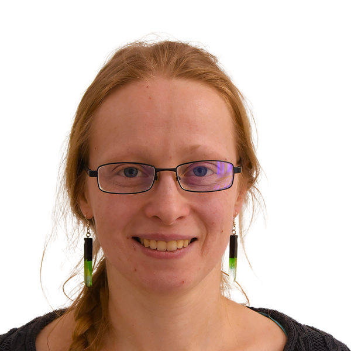
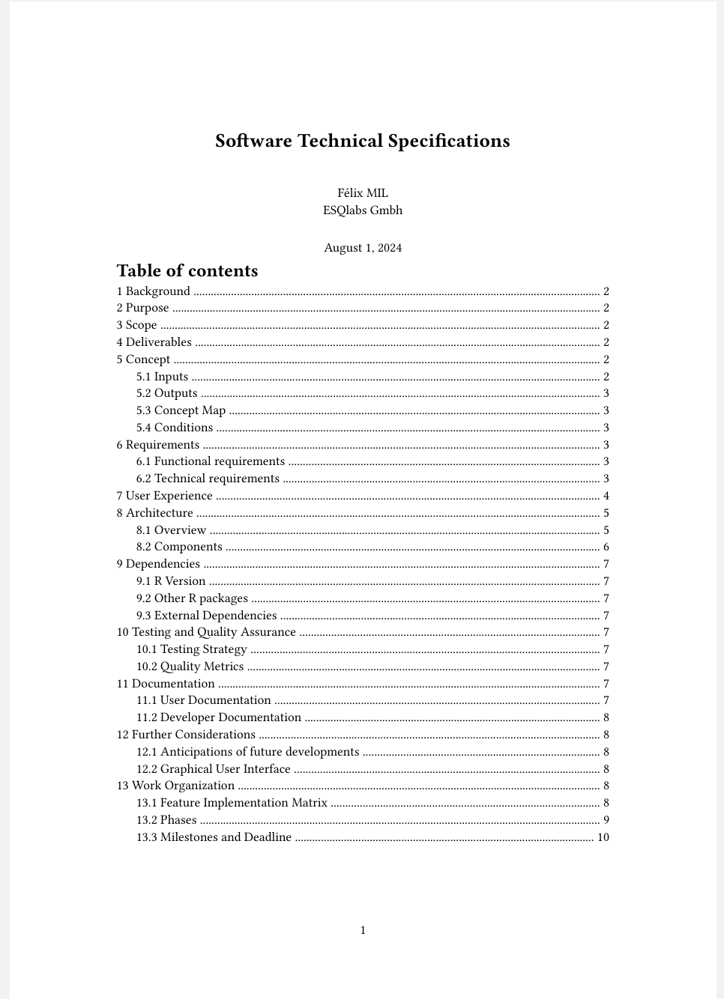

```{r setup, include=FALSE}
knitr::opts_chunk$set(echo = TRUE, message = FALSE)
library(cts)
```

# 🚩 Introduction

## 👥 Presentations

```{css, echo=FALSE}
.portrait {
  border-radius: 50%;
}
```

::: {layout-ncol="3"}
{.portrait width="50%"}

{.portrait width="50%"}

{.portrait width="50%"}

{.portrait width="50%"}

{.portrait width="50%"}
:::

## 🌐 Project Overview

### 🎯 Goal

Develop a clinical trial simulator (**CTS**) for drug-drug interactions (DDI) for contraceptives using physiologically based pharmacokinetic (PBPK) models snapshots.

### 📍 Scope

-   R package
-   Programming Interface

### 📅 Deadline

31th October 2024

------------------------------------------------------------------------

### 📦 Deliverables

-   R package
-   User documentation
-   Test suite
-   Continuous integration workflows (GitHub Actions)
-   Git repository with entire history

# Concept {.smaller}

------------------------------------------------------------------------

### 📥 Inputs

Compound models snapshots (`.json` files) from:

-   OSP model library (hosted on GitHub)
-   Local file or url

### 📤 Outputs

-   DDI model snapshot (`.json`) or project (`.pksim5`)
-   Simulation results (`.csv`)
-   Simulation file (`.pkml`)
-   PK statistics summary
-   Figures

------------------------------------------------------------------------

### 🗺️ Concept Map

{fig-align="center"}

# ✅Requirements {.smaller}

## 👤 User Requirements

-   Easily install the package,
-   Browse and select compounds from the OSP model library,
-   Import compounds snapshots from a json file path or a url,
-   Review the compound model parameters,
-   Review the DDI model parameters,
-   Parameterize some aspects of the DDI simulation,
-   Define Study Design,
-   Export the DDI model as a Project Snapshot,
-   Import a DDI model snapshot,
-   Run the DDI simulation and export the results,
-   Get a PK statistics summary from the simulation results.

## ⚙️ Technical requirements

-   The package must be testable on different environments,
-   The codebase must be versioned, revertable and tracable.
-   The development environment must be reproducable.

# 🧑‍💻 User Experience

## Install and load the package

The package can be installed from GitHub using the following command:

``` r
install.packages("pak")
pak::pak("esqlabs/cts")

library(cts)
```

## Browse, get and review OSP Model Library

```{r, eval = FALSE}
list_compounds()
```

```{r, echo=FALSE}
#| output-location: default
cat("
      • Alfentanil
      • Alprazolam
      • Amikacin
      • Atazanavir
      • Carbamazepine
      • Cimetidine
      • Clarithromycin
      • Dapagliflozin
      • Efavirenz
      ...")
```

## Import compounds from OSP model library or file

```{r}
rifampicin <- compound("Rifampicin")

str(rifampicin,max.level = 1)
```

. . .

``` r
compound_2 <- compound("path/to/local/snapshot.json")
# compound_2 <- compound("https://url/to/snapshot.json")
```

## Create and review DDI simulation

``` r
myDDI <- create_ddi(rifampicin, compound_2, [options])

myDDI
# DDI Simulation
# --------------
# - Compound 1: compound 1 Name
# - Compound 2: Compound 2 Name
# - Parameters: ...
```

## Parameterize DDI simulation

``` r
protocol_1 <- protocol(dose = 250, dose_unit = "mg", start = 0, end = 30, interval = 1, time_unit = "days")

set_protocol(myDDI, compound = "Compound 1 Name", protocol = protocol_1)

individual <- individual(sex, age, weight, height, ...)

set_individual(myDDI, individual = individual)
```

## Run the DDI simulation and export results in several formats

``` r
run_ddi(myDDI, path = "path/to/output", 
        format = "csv", # export format
        pkml = TRUE, # export simulations as pkml files
        plots = TRUE,  # generate plots
        stats = TRUE # computes PK statistics
        )
```

## Export the DDI simulation as snapshot and/or project

``` r
export_ddi(myDDI, name = "myDDI", 
           snapshot = TRUE, # exports snapshot .json file
           project = TRUE # exports .pksim5 file
           )
```

# 🔢 Development Phases

------------------------------------------------------------------------

### 🏗️ Phase 1: Foundations

-   Snapshot Import
-   PKSim Core integration and {ospsuite} update
-   Snapshot merge

### 🚀️ Phase 2: Output generations

-   Run and export results
-   Export and import DDI snapshot

------------------------------------------------------------------------

### ✏️ Phase 3: Review and Customization

-   Review input snapshots parameters
-   Review DDI parameters
-   Parameterize DDI

### 📊 Phase 4: Reporting

-   Figures
-   PK statistics

#  🔄 Feedback Loop

------------------------------------------------------------------------

### Agile Software Development

- Iterative and incrementatl implementation
- Early and continuous deliveries,
- Flexible planning and adaptive scope,
- Continuous feedback and improvement through client collaboration.

➡️ Technical Demo will be proposed at each phase end.

# 📄 Technical Specifications Document

------------------------------------------------------------------------

{fig-align="center" width="40%"}


# ❓Q&A
