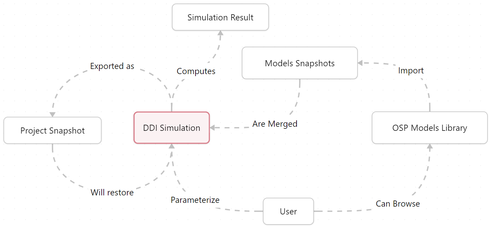
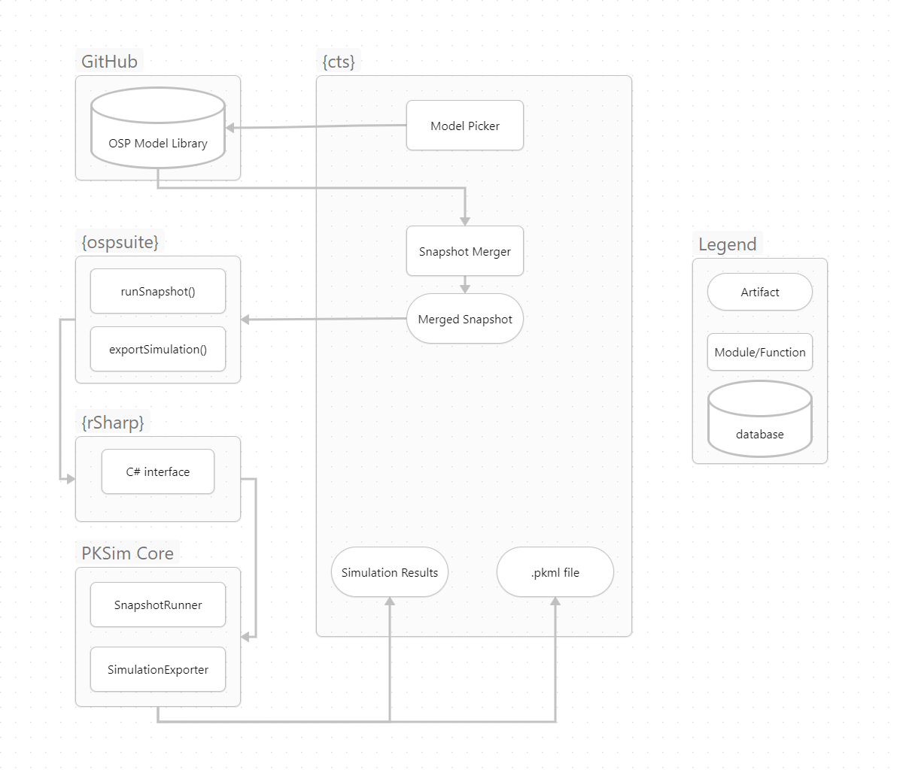

# add a setup chunk
```{r setup, include=FALSE}
library(lobstr)
library(jsonlite)
```



# Background

<!-- Briefly describe the project and its objectives. -->

The project aims to develop a clinical trial simulator (**CTS**) for drug-drug
interactions (DDI) for contraceptives using physiologically based
pharmacokinetic (PBPK) models. The simulator will allow researchers to
design and evaluate clinical DDI trials for contraceptive drugs in
silico, reducing the time, cost, and ethical issues associated with
human trials.

# Purpose

<!-- Explain why this package is being developed and the problems it aims to solve. -->

The purpose of the proposed `{cts}` package is to provide a
comprehensive and easy-to-use R framework for designing DDI models from
PBPK models available in the [OSP model
library](https://github.com/Open-Systems-Pharmacology/OSP-PBPK-Model-Library).

# Scope

<!-- Define the boundaries of the project, including what is included and excluded. -->

The project will focus on the development of an R package that will
provide the features necessary to design and run DDI simulations between
two compounds.

This package is purely programmatic and will not include a graphical
user interface (GUI) such as a shiny application.

# Deliverables

<!-- List the primary goals and deliverables of the project. -->

-   R package
-   User documentation
-   Test suite
-   Continuous integration workflows (GitHub Actions)
-   Git repository with entire history

# Concept

## Inputs

As inputs, the users select two compounds models available in the OSP
model library.
These compound model snapshots are standardised json files generated from PKSim
and has this default structure:

```{r, echo = FALSE}
lobstr::tree(jsonlite::fromJSON("../../inst/extdata/model-snapshots/Rifampicin-Model.json", simplifyDataFrame = F), max_depth = 1)
```


## Outputs

As outputs, the user will be able to get: 

- A snapshot of the DDI model, 
- The results of the simulation, 
- a simulation project file (.pkml) that can be used to run the simulation in PKSim.

## Conditions

The user needs an internet connection to retrieve models from the OSP
model library hosted on GitHub.

## Concept Map



# Requirements

## Functional requirements

As a user, I want to be able to:

-   Easily install the package,
-   Browse and select compounds from the OSP model library,
-   Review the DDI model parameters,
-   Export the DDI model as a Project Snapshot,
-   Export the result of the DDI simulation,
-   Import a DDI model snapshot.

## Technical requirements

-   The package must be testable on different environments,
-   The codebase must be versioned, revertable and tracable.
-   The development environment must be reproducable.

# User Experience

::: callout-note
The pseudo code snippets below are illustrative and do not represent the
final implementation as technical details can impact it.
:::

### Install and load the package

The package can be installed from GitHub using the following command:

``` r
install.packages("pak")
pak::pak("esqlabs/cts")

library(cts)
```

### Browse, get and review OSP Model Library

``` r
list_compounds()
# [1] "Compound 1 Name" "Compound 2 Name" "Compound 3 Name"

compound_1 <- compound("Compound 1 Name")

compound_1
# Compound 1 Name
# -----------
# - Parameters: ...

compound_2 <- compound("Compound 2 Name")
```

### Create and review DDI simulation

``` r
myDDI <- create_ddi("compound_1", "compound_2", [options])

myDDI
# DDI Simulation
# --------------
# - Compound 1: compound 1 Name
# - Compound 2: Compound 2 Name
# - Parameters: ...
```

### Export the DDI simulation as snapshot/project

``` r
export_ddi(myDDI, name = "myDDI", format = "snapshot")
```

### Run the DDI simulation

``` r
run_ddi(myDDI, path = "path/to/output", format = "csv", pkml = TRUE)
```

# Architecture

## Overview

<!-- Provide a high-level diagram and description of the system architecture. -->

In the proposed architecture, the `{cts}` package will be developed as
an orchestrator between several other components in order to provide a
complete solution and make use of existing features available in other R
packages of the `{ospsuite}` ecosystem.

The following diagram illustrates the architecture of the `{cts}`
package.



## Components

<!-- Describe the main components of the package and their interactions. -->

### `{cts}` R package

The `{cts}` will be the main package of the project. It will be in
charge of:

-   Being the main interface between the user and the workflow,
-   Orchestrating the different components to provide a complete
    workflow,
-   Interacting with the OSP model library and retrieve the available
    models,
-   Merging model snapshots (json files) into one.

### `{ospsuite}` R package

The `{ospsuite}` package already contains the necessary tools to
interact with the `{rSharp}` package wich will be necessary to interact
with the PKSim Core. Moreover, the features that need to be implemented
for this project can benefit the whole {ospsuite} package and its users.

Thus, the `{ospsuite}` package will be extended in order to provide:

-   A convenient interface with PKSimCore for running simulations from
    snapshot files,
-   A convenient interface with PKSimCore to export simulations files
    (.pkml) from a snapshots.

### `{rSharp}`

The `{rSharp}` already contains all the necessary tools act as a bridge
between R and the C# core of PKSim.

### PKSim Core

The PKSim Core already contains the methods to perform the necessary
actions. However, as they were not planned to be used this way, they
will be modified to be exposed and be in charge of:

-   Running the simulation from snapshot files,
-   Exporting simulations files (.pkml) from a snapshot file.

```{=html}
<!-- ## Data Flow

Outline how data will flow through the system. -->
```
# Dependencies

## R Version

<!-- Specify the minimum R version required. -->

Development will start with R version 4.4.0 and is set as minimum
required version.

## Other R packages

<!-- List any external R packages or system dependencies. -->

There is no predefined list or restrictions in using other R packages so
any required packaged will be added as dependency while keeping their
number as low as possible.

Except for the OSP and ESQlabs R packages, all other dependencies must
be available on CRAN.

## External Dependencies

As the framework is based on {ospsuite} and {rSharp}, two external
dependencies are required:

-   DotNet Runtime
-   C++ redisttributable

Instructions for installing these dependencies on Windows and Ubuntu can
be foud
[here](https://github.com/Open-Systems-Pharmacology/OSPSuite-R?tab=readme-ov-file#installation).

# Testing and Quality Assurance

## Testing Strategy

<!-- Describe the overall testing strategy, including types of tests to be performed. -->

-   Create Unit tests for all objects and functions defined in the
    package,
-   Minimum test coverage: 80%

## Quality Metrics

<!-- Define any quality metrics or acceptance criteria. -->

-   All tests must pass
-   R CMD Check must pass on both Windows and Linux CI environments
    (GitHub Actions)

# Documentation

## User Documentation

<!-- Outline the types of documentation that will be provided (e.g., user guide, vignettes). -->

User documentation will be provided in two forms:

-   Function references describing the functions purpose, arguments and
    return values using the roxygen2 format.
-   Vignettes describing the package usage and workflow.

All documentation will be accessible directly from R using the `help()`
function.

## Developer Documentation

<!-- Specify any internal documentation for developers (e.g., API documentation). -->

Functions and classes that are not exported will be documented using the
roxygen2 and will only be accessible from the source code.

# Further Considerations

## Anticipations of future developments

The proposed architecture and workflow have been designed to be flexible
and extensible with anticipated features in mind. These include:

-   Picking some parameters from one compound or another during the
    snapshot merging process,
-   Designing custom administration protocols,
-   Including figure generation in the simulation results.

## Graphical User Interface

The `{cts}` package is first thought as a standalone programing
interface concentrating all the business logic. This both enable code
only approach and the possibility to integrate the package in a shiny
application that would provide a convenient graphical user interface.

# Work

## Estimates and Timeline

<!-- Provide a high-level project timeline with major milestones. -->

## Phases

<!-- Break down the development process into phases (e.g., planning, development, testing, deployment). -->
